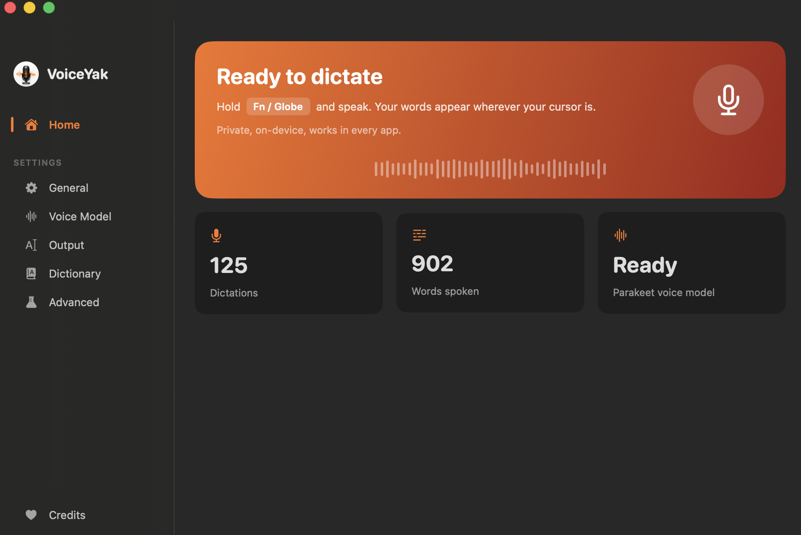
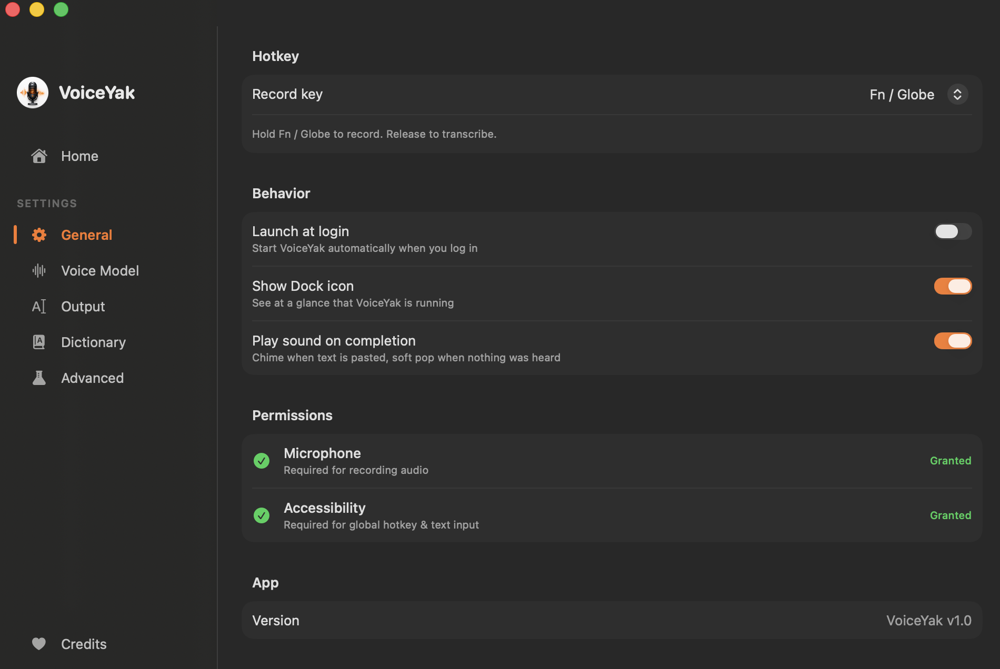
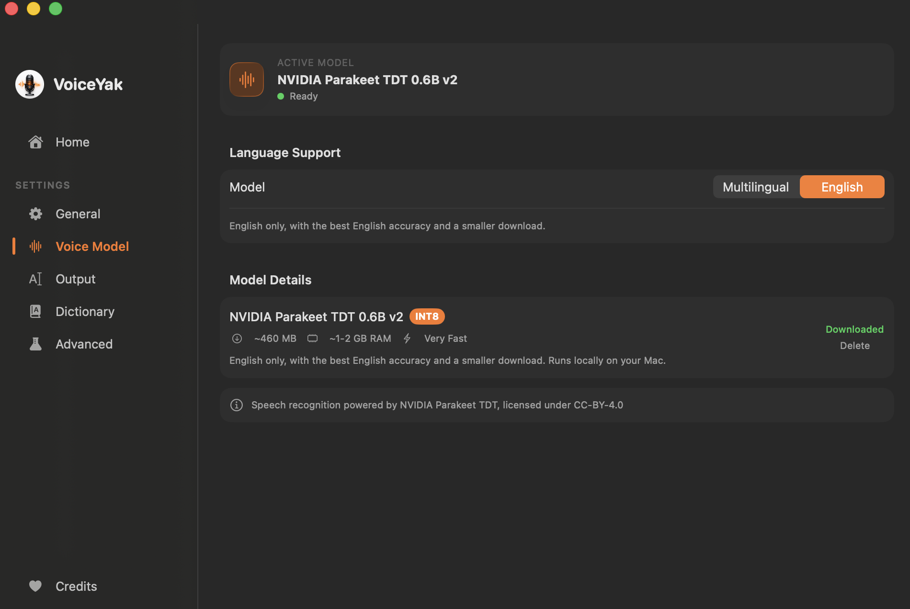
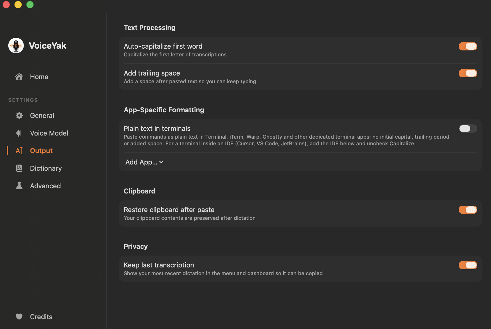
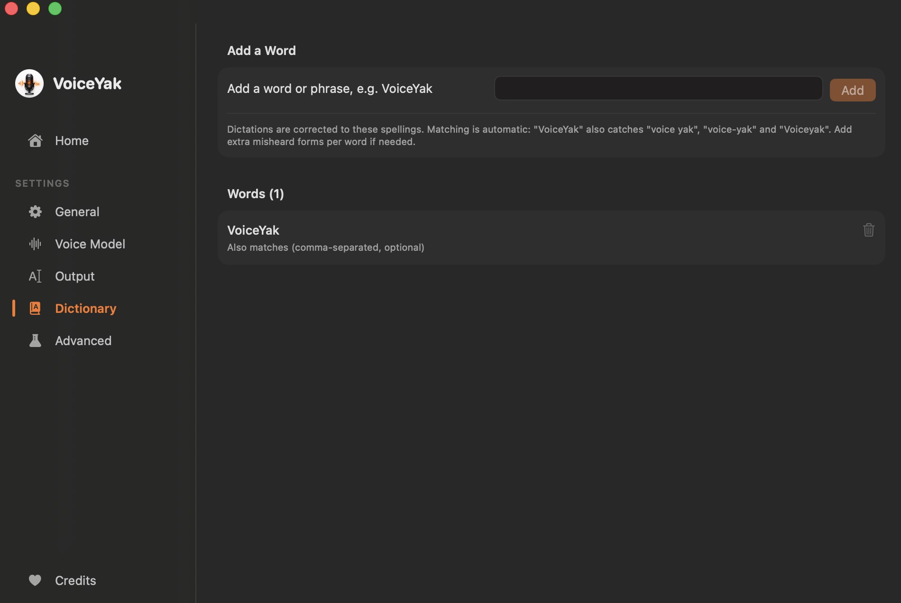
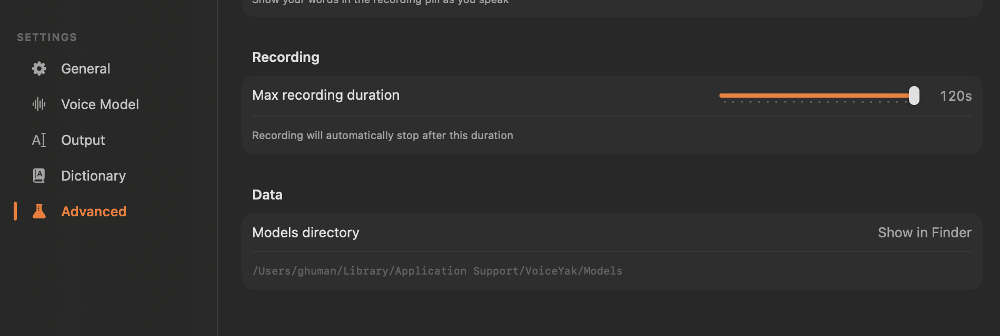

# VoiceYak

**System-wide dictation for macOS. Completely private, 100% offline.**

VoiceYak is a free, open-source menu bar app. Hold a key, speak, release — your words are transcribed locally and pasted into whatever app you're typing in. No cloud, no account, no API costs. Audio never leaves your Mac.

## Install

1. **[Download VoiceYak 1.0.1 (DMG)](https://github.com/g-ghuman/VoiceYak/releases/latest/download/VoiceYak-1.0.1.dmg)**, open it, and drag VoiceYak into Applications.
2. Open VoiceYak. macOS blocks the first launch because the app is not notarized with Apple and says it "could not verify VoiceYak is free of malware". Click **Done** (not "Move to Trash").
3. Open **System Settings → Privacy & Security**, scroll down to the Security section, and click **Open Anyway** next to the VoiceYak message, then confirm. This is a one-time step; macOS remembers the choice.
4. VoiceYak guides you through Microphone and Accessibility permissions and downloads the voice model on first launch.

If you prefer the Terminal, this clears the quarantine flag in place of steps 2 and 3:

```sh
xattr -d com.apple.quarantine /Applications/VoiceYak.app
```

All versions are on the [Releases](https://github.com/g-ghuman/VoiceYak/releases) page. You can also [build from source](#building-from-source), which avoids the unnotarized-app step entirely.

## How it works

1. VoiceYak lives in your menu bar (no Dock icon)
2. In any app — Slack, your editor, a browser — **hold the push-to-talk key** (default: Right Option `⌥`)
3. A small pill appears at the bottom of the screen while you **speak**
4. **Release the key** — the audio is transcribed on-device and pasted at your cursor

Transcription is powered by [NVIDIA Parakeet TDT 0.6B v3](https://huggingface.co/nvidia/parakeet-tdt-0.6b-v3) (int8) running locally via [sherpa-onnx](https://github.com/k2-fsa/sherpa-onnx). It supports English and 24 other European languages, and transcribes short clips in well under a second on Apple Silicon.

## Features

- **Works in every app** — editors, browsers, chat, terminals: anywhere you can type
- **Push-to-talk key of your choice** — Right/Left Option, Right Command, Right Control, Right Shift, or Fn/Globe
- **Two voice models** — English for the best English accuracy, or Multilingual for English plus 24 other European languages; switch anytime
- **Custom dictionary** — teach VoiceYak names, brands, and jargon; common misheard forms are matched automatically
- **Smart text output** — auto-capitalization, trailing space, and your clipboard restored after every paste
- **Terminal-aware formatting** — commands paste as plain text in Terminal, iTerm, Warp, Ghostty, and any app you add, with per-app rules
- **Long dictations** — record for up to two minutes per press
- **Menu bar native** — optional Dock icon, launch at login, completion sounds, and a dashboard with your dictation stats
- **Private by design** — on-device transcription, no telemetry, no account; the only network request ever made is the one-time model download

## Screenshots

|  |  |
|:--:|:--:|
|  |  |
|  |  |

## Requirements

- macOS 26.2+ on Apple Silicon
- ~700 MB of disk space for the speech model (downloaded on first launch)
- Microphone permission (recording) and Accessibility permission (global hotkey + paste)

## Building from source

Building requires the full [Xcode](https://apps.apple.com/app/xcode/id497799835) app (free on the Mac App Store). The Command Line Tools alone are not enough. After installing Xcode, launch it once so it can finish setup, then point the command line tools at it:

```sh
sudo xcode-select -s /Applications/Xcode.app/Contents/Developer
```

If you skip this and only have the Command Line Tools, `xcodebuild` fails with "tool 'xcodebuild' requires Xcode, but active developer directory '/Library/Developer/CommandLineTools' is a command line tools instance". The command above fixes it.

Then build:

```sh
git clone https://github.com/g-ghuman/VoiceYak.git
cd VoiceYak
./Scripts/fetch-sherpa-onnx.sh   # downloads the prebuilt sherpa-onnx static library
xcodebuild -project VoiceYak.xcodeproj -scheme VoiceYak -configuration Release build CODE_SIGN_STYLE=Manual CODE_SIGN_IDENTITY=-
```

The built app lands in Xcode's DerivedData folder; the last lines of the build output show the full path. Move `VoiceYak.app` from there to `/Applications`.

If you don't want to install Xcode, follow the [Install](#install) steps at the top instead.

Or open `VoiceYak.xcodeproj` in Xcode, pick your own team under Signing & Capabilities (a free personal team works), and run. The project does not ship with a development team set, so Xcode asks once and remembers your choice. Building with your own team keeps the app's signature stable across rebuilds, so macOS permission grants stick; the ad-hoc command above re-signs on every build, which makes macOS ask for Microphone and Accessibility again after each rebuild.

The app guides you through permissions and the model download on first launch.

## Architecture

Small Swift/SwiftUI codebase (~2,500 lines), no third-party Swift dependencies:

```
VoiceYak/
├── App/            AppState (status state machine), AppDelegate (wiring)
├── Services/
│   ├── HotkeyManager       CGEvent tap for the push-to-talk key (listen-only)
│   ├── AudioRecorder       AVAudioEngine capture → 16 kHz mono Float32
│   ├── ParakeetService     sherpa-onnx offline recognizer
│   ├── TextOutputService   clipboard save → paste (⌘V) → clipboard restore
│   └── ModelDownloader     model download + extraction
├── Views/          Menu bar popover, recording pill, onboarding, settings
└── Helpers/        Constants, permissions, UserDefaults accessors
```

## Privacy

Everything runs on-device. VoiceYak makes exactly one kind of network request: downloading the speech model from GitHub on first setup. There is no telemetry, no analytics, no account.

## License

VoiceYak is released under the [MIT License](LICENSE).

Third-party components are listed with full license texts in
[THIRD-PARTY-NOTICES.md](THIRD-PARTY-NOTICES.md) and in the app's Credits
tab. The main ones:

- [sherpa-onnx](https://github.com/k2-fsa/sherpa-onnx) — Apache-2.0 (built **without TTS** so no GPL code is linked)
- [ONNX Runtime](https://github.com/microsoft/onnxruntime) — MIT
- [NVIDIA Parakeet TDT 0.6B v3](https://huggingface.co/nvidia/parakeet-tdt-0.6b-v3) — CC-BY-4.0 (downloaded at runtime)
